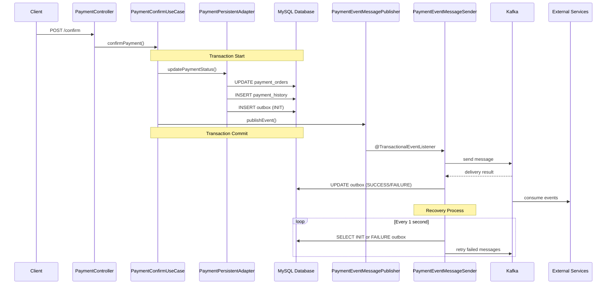

# Payment System
### 1. Checkout 기능 구현
- 동일한 요청 파라미터로 N번 요청을 보내도 1번만 수행되어야 한다면? -> 멱등성 보장
  - 따닥 이슈, 네트워크 이슈로 동일한 주문에 대해 N번 결제를 요청했을 때 N번의 결제가 이루어지면 안됨.
  - 이런 일이 생기지 않도록 하기 위해 결제 API는 [멱등성](https://docs.tosspayments.com/blog/what-is-idempotency)을 보장할 수 있어야 한다.
  - 멱등성을 보장하기 위해 멱등성 Key가 필요한데 이번 구현에서는 Checkout 시점에 멱등성 Key를 만들고 orderId로 저장한다.
  - 결국, 동일한 주문을 식별할 수 있는 Key값을 결제 멱등성 Key로 사용한다.
  - 그런데 `동일한 주문`을 어떻게 볼 것인가를 먼저 고민해봐야 할 것 같다.
  - 현재 tossPayment 결제 페이지로 들어가는 시점에 orderId를 만든다.
  - 하지만 실제 이커머스 서비스에서는 주문/결제 페이지에 진입하는 시점에 `동일한 주문을 식별하는 ID` = `멱등성 Key`를 만든다.

### 2. 재처리 시도
- 재시도 시 고려할 사항
  - `Exponential backoff`
    - 재시도 사이에 일정 시간 지연을 설정하는 것이다. 서버가 과부하로 인해 응답을 전달하지 못하는 경우를 대비해서 일정시간 지연 시간은 재시도마다 지수적으로 증가한다. 
    - 예를 들면, 첫 번째 재시도에는 1초 동안 대기하고, 두 번째 재시도에는 2초 대기, 세 번째 재시도에는 4초 대기, 네 번째 재시도에는 8초 대기 후 재시도를 수행한다.
  - `Jitter`
    - 여러 요청이 동시에 재시도 되면서 서버 과부하의 원인이 될 수 있기 때문에 Exponential 외에도 무작위 지연을 추가로 부여하는 것이다.
  - `Retry Limited Count`
    - 무한으로 재시도를 수행하며 서버 자원을 소모시키는 것을 방지하기 위한 최대 재처리 횟수
- 타임아웃
  - 타임아웃 종류와 서비스 성격에 맞춰 적절한 타임아웃을 설정해 리소스를 효율적으로 관리해야 한다.
  - 한 요청이 리소스를 독점하지 않도록...
    - 연결 타임아웃(Connection Timeout): 서버와의 연결을 시도할 때까지의 시간을 말한다. 
    - 요청 타임아웃(Request Timeout): 요청을 보낸 후 서버로부터 응답을 받기까지의 시간을 말한다.
  
### 3. 결제 복구 시스템
- 웹 요청과 별도의 분리된 자원으로 복구 로직 수행하기 -> Bulk Head Pattern
  - 스케줄러를 통해 결제 복구 시스템을 구현한다.
  - 이때 스케줄러가 사용하는 ThreadPool을 분리해 서비스의 웹 요청과 리소스를 분리해 서로의 영향을 줄인다.
  - 하지만 실제 서비스에서는 결제 복구 시스템을 동일 서비스의 스케줄러로 두지 않을 것 같다.
  - Bulk Head Pattern도 간단히 시도할 수 있는 격리 방법이지만, 별도의 배치로 돌려서 API 서버와 공유하는 리소스는 DB만 두는 게 좋아 보인다.
- Scalability 고려하기
  - 현재 구현처럼 API 서버에 Scheduler로 결제 복구 시스템을 두면 Scale을 늘리면 중복 처리의 가능성이 발생한다.
  - 가장 간단히는 Lock을 활용해 동시에 수행이 안 된도록 할 수 있다.
  - 단, Scale을 늘려 처리량을 높이고 싶다면 `Partitioning`을 통해 각 POD가 접근할 데이터를 분리해야 한다.
  
### 4. 결제 승인 완료 Event 발행

  
### 5. Kafka 신뢰성 있게 사용하기
#### (1) Kafka의 기본 신뢰성 보장
- 토픽 파티션 내 메시지들의 순서 보장
- 레플리카 존재 시 복제를 통한 메시지 유실 방지

#### (2) Kafka의 복제 시스템
- 카프카는 MySQL 같은 DB와 달리 fsync()로 즉시 디스크에 쓰지 않고, Page Cache에 먼저 저장한 후 시간이 지나면 디스크로 반영한다. 
- 때문에 브로커 다운 시 데이터 유실 위험이 있다.
- Kafka는 위 문제를 레플리카 복제를 통해 해결하려 한다.

#### (3) Broker 주요 설정
- 복제 관련
  - `replication.factor`: 파티션 복제 수 설정
  - `default.replication.factor`: 자동 생성 토픽의 기본 복제 수
  - `min.insync.replicas`: 최소 In-Sync 레플리카 수 (고가용성과 신뢰성 사이에서 최적화)
- 내구성 관련
  - `log.retention.hours`: 메시지 보관 기간 (기본 168시간)
  - `log.retention.bytes`: 크기 기반 보관 제한 
  - `log.segment.bytes`: 세그먼트 최대 크기 (기본 1GB)
  - `message.max.bytes`: 최대 메시지 크기 (기본 1MB)

#### (4) Producer 주요 설정
- 메시지가 브로커에 복제될 때까지 대기하는 것
  - `acks=all`: 모든 In-Sync 레플리카에 복제 완료까지 대기 (가장 안전)
  - `acks=1`: 리더 토픽 파티선에서만 기독된 후 응답을 받는다.
  - `acks=0`: 응답을 기다리지 않는다.
- 응답 처리 방식
  - 동기 방식: 일반적인 패턴. 요청 후 응답 대기
  - 비동기 처리 방식: 요청 후 응답을 대기하지 않고 응답이 올 때 callback 메서드 실행. 처리량을 높일 수 있고 트랜잭셔널 아웃 박스 패턴을 활용하면 발행 보장이 가능.
- 메시지 전송이 실패한다면 재시도하는 것
  - 메시지 전송 실패 시 내부적으로 자동 재시도 수행
  - 재시도 횟수: 기본적으로 Int.MAX 값 (거의 무제한)
  - 시간 제한: deliver.timeout.ms 설정 (기본 2분)
  - 카프카에 이미 재시도 메커니즘이 내장되어 있음, Application에서 추가 재시도 시 중복 발행 위험

- 메시지 순서를 보장하는 것
  - `max.in.flight.requests.per.connection`: 설정 값만큼 메시지를 한번에 보낸다.
  - 실패 건이 생기면 순서가 뒤로 밀리게 된다.
  - `enable.idempotency=true`: 멱등성 Producer로 변경하면 Producer 식별자와 메시지 순서를 사용해 Broker에서 메시지 순서 보장 및 중복 방지
  - 하지만 다중 프로듀서에서 동일 파티션으로 메시지 발행 시 전체 메시지 순서 보장 어렵다. 
    - Global Message Id 또는 파티션 당 한 Producer를 보장
- 메시지 중복을 없애는 것 
  - 기본적으로 멱등성 Producer를 사용하면 Message 중복 발행 방지가 보장된다.
  - 하지만 멱등성 Producer 사용해도 앱 크래쉬로 Message 발행 성공 응답을 못 받은 후 재부팅 되면 Producer Id가 달라져 메시지가 중복 발행될 수 있다.
  - 이 경우를 방지하려면 트랜잭셔널 Producer를 사용해 동일한 Producer Id를 보장하고 Epoch Number로 최신 프로듀서만 발행 가능하도록 유지 가능

#### (5) Consumer 주요 설정
- 필수 설정
  - group.id: 컨슈머 그룹 설정 (처리 목적별 분리)
  - auto.offset.reset:
    - earliest: 첫 메시지부터 (누락 방지, 중복 고려 필요)
    - latest: 최신 메시지부터
    - none: 오프셋 없으면 에러
- 오프셋 관리
  - `자동 커밋 (enable.auto.commit=true)`: 간단하지만 중복 처리 가능
  - `수동 커밋 (enable.auto.commit=false)`: 정확한 제어 가능, 복잡함
- Dead Letter Queue (DLQ)
  - 실패한 메시지를 별도 토픽으로 분리하여 전체 처리 성능 보호