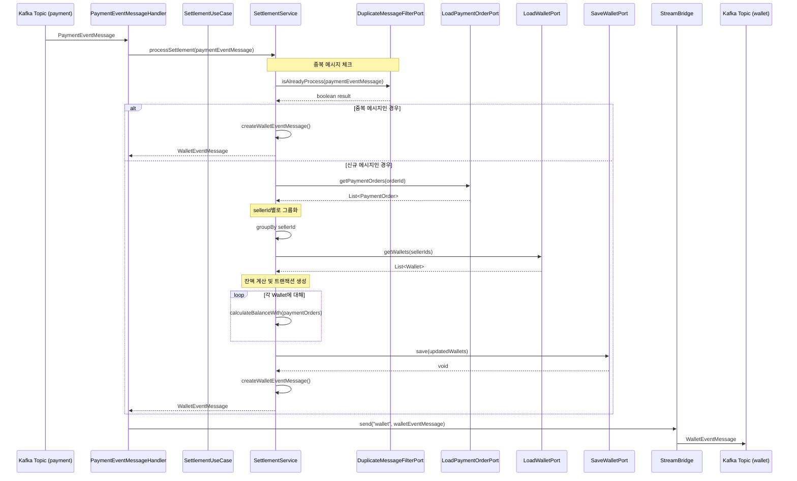

# Wallet System

### 1. 정산(Settlement) 처리 기능 구현

```mermaid
sequenceDiagram
      participant KAFKA as Kafka Topic (payment)
      participant HANDLER as PaymentEventMessageHandler
      participant UC as SettlementUseCase
      participant SERVICE as SettlementService
      participant FILTER as DuplicateMessageFilterPort
      participant LOAD_PO as LoadPaymentOrderPort
      participant LOAD_W as LoadWalletPort
      participant SAVE_W as SaveWalletPort
      participant BRIDGE as StreamBridge
      participant KAFKA_OUT as Kafka Topic (wallet)

      KAFKA->>HANDLER: PaymentEventMessage
      HANDLER->>SERVICE: processSettlement(paymentEventMessage)

      Note over SERVICE,FILTER: 중복 메시지 체크
      SERVICE->>FILTER: isAlreadyProcess(paymentEventMessage)
      FILTER-->>SERVICE: boolean result

      alt 중복 메시지인 경우
          SERVICE->>SERVICE: createWalletEventMessage()
          SERVICE-->>HANDLER: WalletEventMessage
      else 신규 메시지인 경우
          SERVICE->>LOAD_PO: getPaymentOrders(orderId)
          LOAD_PO-->>SERVICE: List<PaymentOrder>

          Note over SERVICE: sellerId별로 그룹화
          SERVICE->>SERVICE: groupBy sellerId

          SERVICE->>LOAD_W: getWallets(sellerIds)
          LOAD_W-->>SERVICE: List<Wallet>

          Note over SERVICE: 잔액 계산 및 트랜잭션 생성
          loop 각 Wallet에 대해
              SERVICE->>SERVICE: calculateBalanceWith(paymentOrders)
          end

          SERVICE->>SAVE_W: save(updatedWallets)
          SAVE_W-->>SERVICE: void

          SERVICE->>SERVICE: createWalletEventMessage()
          SERVICE-->>HANDLER: WalletEventMessage
      end

      HANDLER->>BRIDGE: send("wallet", walletEventMessage)
      BRIDGE->>KAFKA_OUT: WalletEventMessage
```